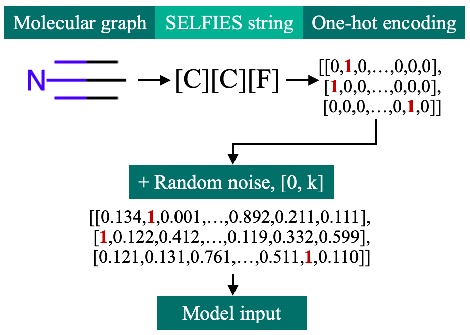
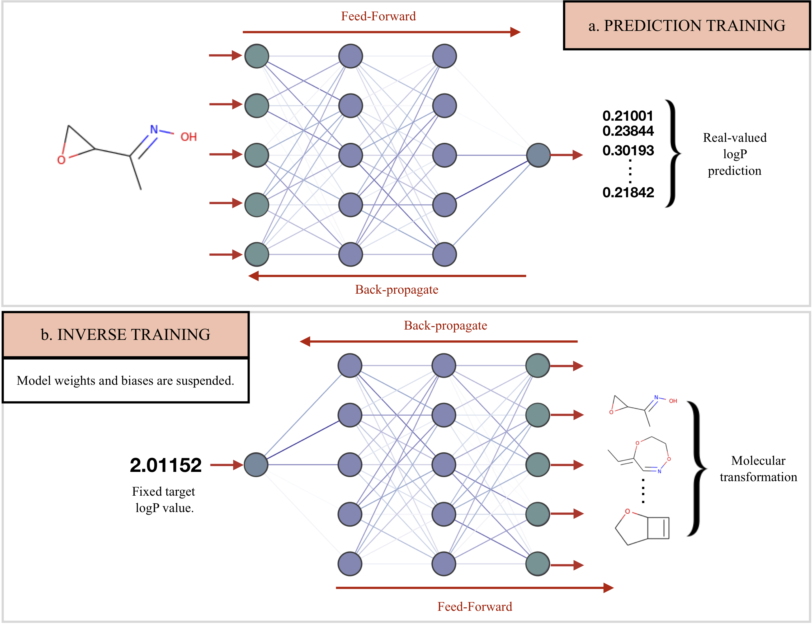

# Pasithea

This repository contains code for Pasithea, a gradient-based method for property optimization on molecules. At the core of model is a simple fully-connected neural network. Integral to the model are the following additional components:
* SELFIES, a 100% valid representation of molecular graphs
* We also add random noise to molecular inputs. Every zero in the one-hot encoding is replaced with a random decimal in the range [0, k], where k is a specified upperbound.

At a high-level, there are two main steps:
1. Train the neural network on one-hot encoded SELFIES inputs and continuous logP outputs.
2. Inverse-train the neural network. Given a single logP and a single molecule, the network generates molecular variants that are optimized toward the logP value. The weights and biases remain fixed.

### Usage
The provided script `demo.py` may be used to view some molecular transformations and logP optimization. The current hyperparameters are set in `settings.yml`. You may also visualize the shifts in logP distribution using the module `distribution_analysis.py`.

### Code structure
* `settings.yml`: Hyperparameter tuning.

* `train.py`: Script for training the neural network on regression.

* `dream.py`: Script for inverse-training and generating optimized molecules.

* `model.py`: Implementation of neural network.

* `data_loader.py`: Methods for data preprocessing.

* `utils.py`: General purpose utils.

* `{mol/plot}_utils.py`: Util modules for adding noise to inputs, converting between molecular representations, and visualization. 

Below are modules you can run to generate molecules and visualize the results:

* `demo.py`: Experiment with the model on input molecular data. You may tweak the settings in `settings.yml`.

* `distribution_analysis.py`: Visualize distribution shifts from a set of molecular transformations.

* `test_mols.py`: Test and visualize individual molecular transformations. You may tweak the settings in `test_mol_settings.yml`.

### References
[1] Shen, Cynthia, Mario Krenn, Sagi Eppel, and Alan Aspuru-Guzik. "Deep Molecular Dreaming: Inverse machine learning for de-novo molecular design and interpretability with surjective representations." arXiv preprint arXiv:2012.09712 (2020).

[2] Krenn, Mario, Florian Häse, AkshatKumar Nigam, Pascal Friederich, and Alan Aspuru-Guzik. "Self-Referencing Embedded Strings (SELFIES): A 100% robust molecular string representation." Machine Learning: Science and Technology 1, no. 4 (2020): 045024.
